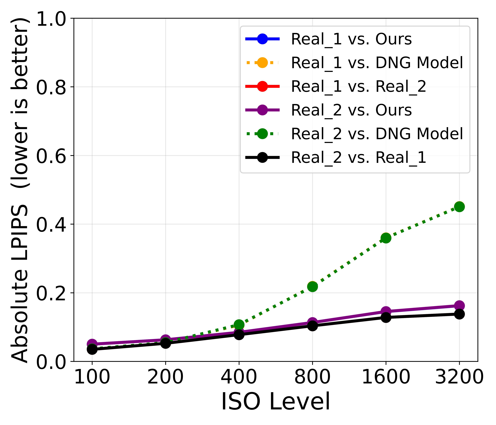
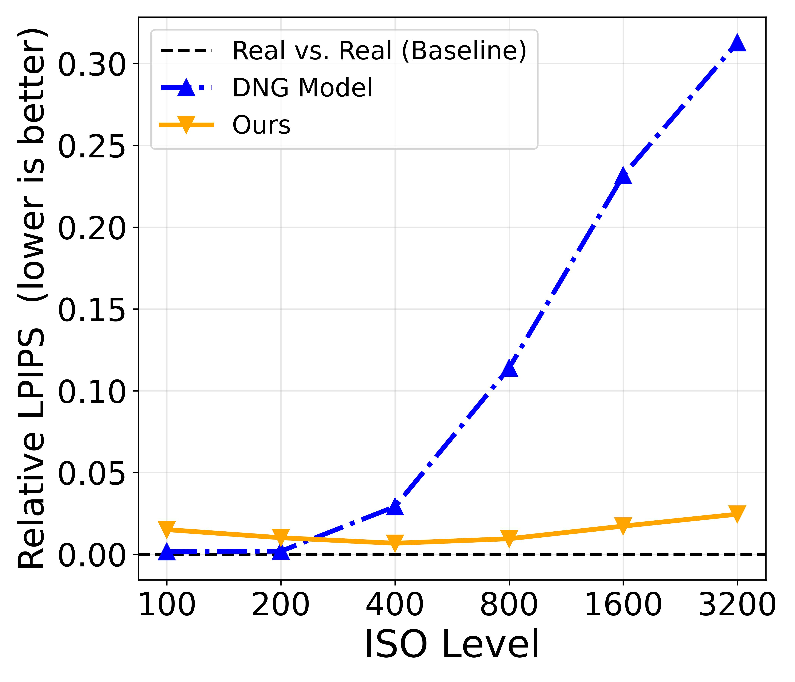
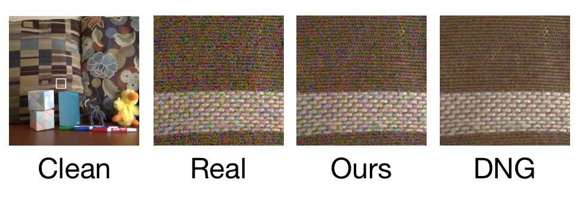

# SNIC
Synthesized Noisy Images using Calibration

---
Author: [Nik Bhatt](mailto:nb3097@columbia.edu), Columbia University

## Table of Contents
- [Abstract](#abstract)
- [Key Contributions](#key-contributions)
- [Results](#results)
- [SNIC Dataset](#snic-dataset)
- [Requirements](#requirements)
- [Running the Code](#running-the-code)
- [Acknowledgments](#acknowledgments)
- [Citation](#citation)
- [License](#license)

## Abstract

Advanced denoising algorithms require large, high-quality datasets. Physics-based, statistical noise models can create such datasets by realistically simulating noise in digital images. However, there is little information on the correct way to calibrate and tune these heteroscedastic models, and a lack of published datasets using them. In this paper, we explore the process of building high-quality heteroscedastic noise models. Our methods produce realistic synthesized noisy images, in both RAW and TIFF formats. Our synthesized noisy images achieve comparable LPIPS results to real noisy images, and greatly outperform those created with manufacturer-provided DNG noise models both in LPIPS and when tested with a state-of-the-art (SOTA) denoising model. Using our approach, we created the Synthesized Noisy Images using Calibration dataset (SNIC) containing over 6000 noisy images, comprising 30 scenes from four sensors, including two smartphone sensors, a point-and-shoot, and a DSLR. SNIC is the first synthesized noisy image dataset provided in both RAW and TIFF format. The paper can be found at [https://arxiv.org/abs/2512.15905](https://arxiv.org/abs/2512.15905).

## Key Contributions

1. Steps for accurately calibrating different types of cameras, from smartphones to DSLRs, and tuning the resulting heteroscedastic models.
2. Description of iPhone noise suppression for flat-field RAW images.
3. Heteroscedastic noise models that achieve a 54% to 64% improvement in PSNR dB vs. standard DNG noise models.
4. The first public, calibrated dataset providing perfectly aligned noisy images in both RAW and TIFF formats. The dataset covers four cameras, 30 scenes, and over 6000 images in total. The dataset is located here: <https://doi.org/10.7910/DVN/SGHDCP>
5. Source code to calibrate, tune, evaluate, and generate high-quality noisy RAW and TIFF images. The code can be found here: <https://github.com/nikbhatt-cu/SNIC.git>

## Results

### Denoising Performance Comparison

We evaluated synthesis quality by testing NAFNet, trained on SIDD, with our real noisy and synthesized noisy images. Results show PSNR/SSIM metrics comparing our method against real noise (baseline) and DNG noise profiles.

| Camera | Metric | Real (Baseline) | DNG P-G | **Ours (NB)** | Real Gap | **Our Gap** | Improvement |
|--------|--------|-----------------|---------|---------------|----------|-------------|-------------|
| **iPhone 11 Pro Main** | PSNR | 25.91 | 31.24 | **27.80** | 5.33 | **1.89** | 64.5% |
|  | SSIM | 0.799 | 0.940 | **0.882** | 0.141 | **0.083** | 41.1% |
| **iPhone 11 Pro Tele** | PSNR | 27.48 | 31.21 | **29.21** | 3.73 | **1.73** | 53.6% |
|  | SSIM | 0.850 | 0.936 | **0.899** | 0.086 | **0.049** | 43.0% |
| **Sony RX100 IV** | PSNR | 32.57 | 32.93 | **32.86** | 0.36 | **0.29** | 19.4% |
|  | SSIM | 0.911 | 0.913 | **0.911** | 0.002 | **0.000** | 100.0% |
| **Sony A7R III** | PSNR | 36.59 | 37.95 | **37.90** | 1.36 | **1.31** | 3.7% |
|  | SSIM | 0.961 | 0.966 | **0.966** | **0.005** | **0.005** | 0.0% |

*Smaller gaps indicate more realistic synthesis. Best results per metric in **bold**.*

### Perceptual Quality (LPIPS)

LPIPS (Learned Perceptual Image Patch Similarity) measures perceptual similarity between image pairs. Lower scores indicate better perceptual quality.

#### Absolute LPIPS
Scores comparing synthesis methods directly against real noisy images:


*Absolute LPIPS scores for iPhone 11 Pro Main camera. Our method achieves scores closest to the real-vs-real baseline.*

#### Relative LPIPS
Relative improvement over real noise baseline:


*Relative LPIPS scores showing our synthesis method significantly outperforms DNG models in perceptual similarity.*

Our synthesized noise achieves perceptual similarity scores nearly identical to real noise pairs, while DNG models show significant perceptual differences.

### Visual Comparison



*Comparison of noise at ISO 800 for the iPhone 11 Pro main camera*

For additional examples, see the paper appendix.

## SNIC Dataset

The Synthesized Noisy Images using Calibration (SNIC) dataset contains:

- **6,000+ noisy images** with perfectly aligned clean/noisy pairs
- **30 scenes** (15 indoor and 15 outdoor) using 4 camera sensors
- **Both RAW and TIFF formats for clean and noisy images**
- **Camera Sensors:**
  - iPhone 11 Pro Main
  - iPhone 11 Pro Telephoto
  - Sony RX100 IV (1-inch sensor)
  - Sony A7R III (Full-frame DSLR)
- **ISO ranges:** 100-12800 depending on camera
- **First synthesized dataset** providing both RAW and TIFF formats

The SNIC dataset is located at <https://doi.org/10.7910/DVN/SGHDCP>

## Requirements

- Python 3.8+
- PyTorch 1.12+
- NumPy
- rawpy
- OpenCV
- scikit-image
- Pillow
- exifread

## Running the Code

### Quick Start

1. **Clone the repository**
```bash
git clone https://github.com/nikbhatt-cu/SNIC.git
cd SNIC
```

2. **Install dependencies**
```bash
pip install -r requirements.txt
```

3. **Set up directory structure**

Create a `data` directory with the following structure (the two cameras are simply examples):
```
data/
  Sony_A7R_III/
    test_shots/
      ISO_100/
        dark_frame/
        gray_card/
        validation/
      ISO_200/
        dark_frame/
        gray_card/
        validation/
  iPhone_11_Pro_Main/
    test_shots/
      ISO_100/
      ...
```

The directory ISO_100 is just an example of a directory - you would make one for each ISO, and put calibration gray card and dark frame images into sub-directories as shown. If you shoot validation images to tune the model, those go in the validation directory (make a directory for each scene).

4. **Configure parameters**

Edit `parameters.py` to set:
- Camera-specific settings
- ISO ranges for your camera

In addition, parameters are specified at the top of files for things like the root directory to write data into. We start with a directory called data, and everything is inside that (see above). The code will build directories as needed.

5. **Run calibration workflow**

The scripts are numbered in execution order:
```bash
python 1_find_gray_card_crop_rect.py
python 2_build_cfa_noise_model.py
python 3_check_dark_frames.py
python 4_calibration.py
python 5_tune_noise_model.py
python 6_inject_noise.py
python 7_aI_b_inject_noise.py
```

Each script includes documentation at the top explaining its purpose and parameters.

### Note on DNG Models

Our calibrated approach provides superior results compared to DNG noise profiles, as demonstrated in the paper. If you still want to generate images using DNG models, you'll need to:
1. Extract the `NoiseProfile` tag from a collection of DNG images at different ISO values
2. Build a noise model in the same format as our calibrated models
3. Use script 7 (`7_aI_b_inject_noise.py`) for synthesis using a DNG noise model.

**We recommend using our calibrated models instead** (scripts 1-6) for best results.

## Acknowledgments

This work uses:
- [NAFNet](https://github.com/megvii-research/NAFNet) for denoising evaluation
- [LPIPS](https://github.com/richzhang/PerceptualSimilarity) for perceptual quality metrics
- Comparison against [SIDD](https://www.eecs.yorku.ca/~kamel/sidd/) benchmark dataset

## Citation

If you use SNIC in your research, please cite:
```bibtex
@article{bhatt2025snic,
  title={SNIC: Synthesized Noisy Images using Calibration},
  author={Bhatt, Nik},
  institution={Columbia University},
  year={2025},
  note={Dataset available at: https://doi.org/10.7910/DVN/SGHDCP}
}
```
## License

This project is MIT licensed - see the LICENSE file for details.
The SNIC dataset is released under MIT.
